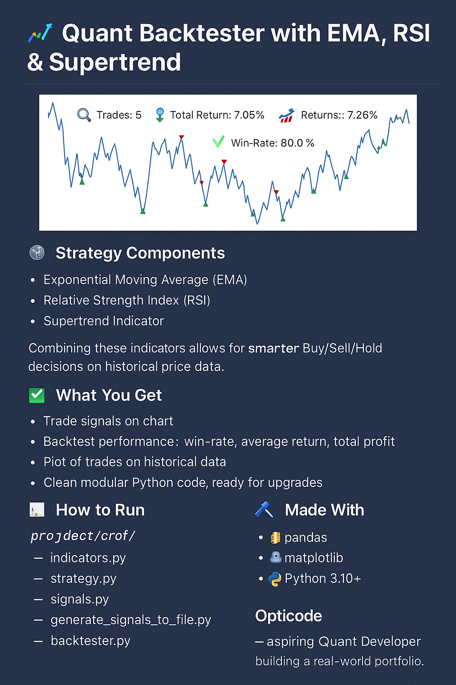

<p align="center">
  
</p>

# 📈 Quant Backtester with EMA, RSI & Supertrend

This is **Project 2** from the `Opticode` quant portfolio series.

🚀 A backtesting tool that loads historical data, applies a custom signal strategy (EMA + RSI + Supertrend), and visualizes performance metrics including trades, returns, and win-rate.

---

## 🧠 Strategy Components

- **Exponential Moving Average (EMA)**
- **Relative Strength Index (RSI)**
- **Supertrend Indicator**

Combining these indicators allows for smarter **Buy/Sell/Hold** decisions on historical price data.

---

## 📊 What You Get

- 🔍 Trade signals on chart  
- 💹 Backtest performance: win-rate, average return, total profit  
- 📈 Plot of trades on historical data  
- ✅ Clean modular Python code, ready for upgrades

---

## 🧪 How to Run

```bash
# Step 1: Generate signals
python generate_signals_to_file.py

# Step 2: Backtest the signals
python backtester.py
